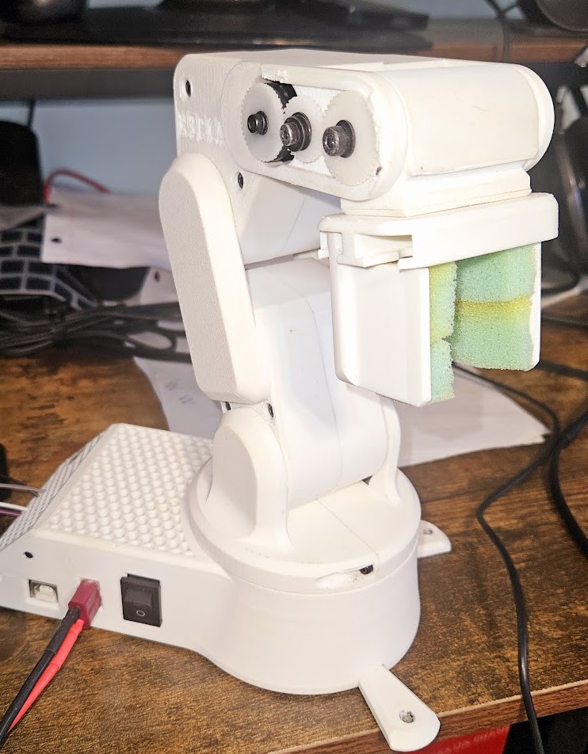

  <h1>Computer Vision Robotic Arm</h1>
  
<strong>A vision-guided 4-DOF robotic arm utilizing OpenCV for object tracking and inverse kinematics for spatial manipulation.</strong>

   
  

 

This project bridges high-level computer vision processing on a Raspberry Pi with low-level bare-metal motor control on an Arduino. It enables autonomous object tracking, cubic-interpolated trajectory generation, and wireless teleoperation.

**Author:** Satvik Chawla

---

## Core Capabilities
- **Automated Object Tracking:** Utilizes OpenCV with adaptive thresholding and contour detection to identify and track objects in real-time.
- **Smooth Trajectory Generation:** Generates 30-step spatial movement paths using a cubic easing function (ease-in/ease-out) to ensure fluid, jitter-free mechanical translation.
- **Wireless Telemetry:** The Python vision pipeline streams target joint states continuously over a TCP socket connection to the hardware controller.

## Hardware Architecture
- **Vision Processor:** Raspberry Pi (Handles camera capture, OpenCV filtering, and target spatial math).
- **Embedded Controller:** Arduino (Handles inverse kinematics, manual overrides, and I2C communication).
- **Actuation:** PCA9685 16-channel I2C PWM driver controlling 5 independent servos:
  - Base (Pan)
  - Shoulder (Pitch)
  - Elbow (Pitch)
  - Wrist (Pitch)
  - Gripper (End-effector)
- **Manual Input:** 4 independent 10-bit analog potentiometers for manual 3D spatial overrides.

## Technical Implementation

### Inverse Kinematics Engine
- **Spatial Target Parsing:** The Arduino firmware receives Cartesian 3D coordinates (X, Y, Z) rather than raw servo angles over the network.
- **Local IK Solver:** Calculates precise relative joint angles locally using a custom fixed-point inverse kinematics solver.
- **Mechanical Constraint Logic:** Ensures the end-effector accurately reaches targets while respecting physical linkage constraints.

### Hardware Abstraction & Calibration
- **Dynamic PWM Scaling:** Kinematic angles are directly scaled into exact PCA9685 12-bit register values (0-4095).
- **Inversion Handling:** Software automatically compensates for the physical inversion of the shoulder servo.
- **Relative Offsets:** Elbow and wrist calculations account for mechanical offsets to keep the kinematic model strictly relative to the ground.

### Continuous Interpolation Pipeline
- **Waypoint Generation:** The Python controller calculates 30 intermediate spatial waypoints between current and target locations.
- **Mathematical Easing:** Applies cubic ease-in/ease-out functions to the waypoints for organic, accelerating/decelerating movement.
- **Hardware Protection:** Incremental transmission prevents violent, high-torque servo jerks, protecting the 3D-printed chassis.
